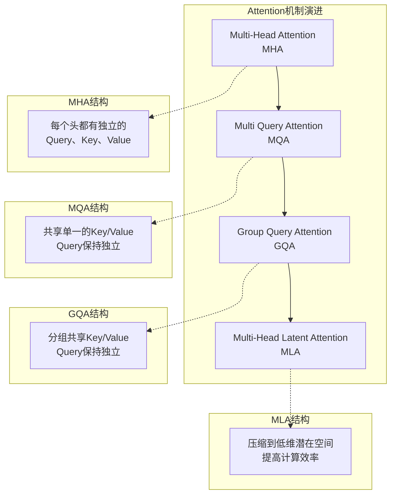

大语言模型(LLM)的推理在企业级多GPU甚至多节点环境下，需要精心设计管道以充分利用硬件资源、降低延迟并提高吞吐量。下面将从总体架构与设计原则、核心优化技术、框架工具链支持，以及最新研究与趋势四个方面，对LLM推理的管道优化进行系统总结。

## 推理管道优化的总体架构与设计原则

**模块划分与流水线设计:** 典型的LLM推理流水线可以划分为若干阶段，包括输入预处理(如分词)、模型推理(又可细分为前填充 Prefill 阶段和自回归解码 Decode 阶段)、以及输出后处理等。在多GPU环境下，还需进一步划分模型计算模块，将模型层权重切分或复制到不同设备上。常见方式有**张量并行**(层内并行)和**流水并行**(层间并行)，甚至结合二者。合理的模块划分应尽量使各GPU负载均衡，减少某些阶段硬件空闲等待造成的"气泡"现象。例如，采用微批次(micro-batching)技术可以减小流水并行中的空闲时间片。此外，针对LLM推理的两个主要阶段:Prefill阶段一次性处理完整输入序列，计算量大但只需单次前向；Decode阶段逐令牌迭代，单步计算量较小但次数众多。调度时需要区分这两类负载，采用分阶段优化策略。

**计算瓶颈识别:** LLM推理的瓶颈既可能来自算力又可能来自内存/带宽。对于深层Transformer，尽管每步解码计算的矩阵乘法等算术操作需要大量GPU算力，但随着序列长度增长，大量Key/Value缓存(KV Cache)的读写使推理逐渐转为内存带宽受限。实际分析表明，KV缓存会随层数、序列长度和批量增大而线性膨胀，例如60层、序列长128k、8注意力头、批量32时，KV缓存可达1.14 TB之巨！这不仅给显存带来巨大压力，也使推理变为"内存绑定"，即每步主要耗时在访存而非计算。因此架构设计中需重点关注**显存瓶颈**(如KV缓存占用)和**计算热点**(如QKV投影的矩阵乘、FeedForward层等)。通过profiling分析各模块耗时，占比最高者往往就是优化重点。通常情况下，LLM推理在短序列时算力瓶颈明显，而在超长序列时内存访问(特别是KV缓存读写)成为瓶颈，需要不同优化手段加以缓解。

**异步调度与并发:** 为了最大化设备利用率，推理管道应采用异步调度，将可并行的任务尽可能重叠执行。例如，使用CUDA流和多线程并发，在GPU执行当前步骤计算的同时，CPU可并行进行下一批数据准备或上一步结果处理，减少流水线阻塞。此外，在多GPU场景下需要重叠通信与计算:如张量并行时边All-Reduce通信边局部计算，流水并行时上一设备计算同时下一设备传输前一小批次结果等。现代LLM推理框架往往支持**在飞批处理**(in-flight batching)和**连续调度**，即在一次推理过程中动态加入新请求，使GPU始终有任务可做。例如，Hugging Face的TGI路由器采用连续动态批处理算法，在不发生OOM的前提下实时将新请求插入当前批次，权衡延迟与吞吐。再比如NVIDIA的TensorRT-LLM执行引擎据观察也是采用每个解码迭代级别调度新请求的**连续批处理**策略。异步调度的原则是在保证执行依赖的前提下，尽量并行交叠各环节以减少空闲时间，从而提高整体吞吐量和硬件利用率。

## 核心优化技术

### KV Cache管理与压缩

**KV缓存的重要性与挑战:** 自回归Transformer模型在解码过程中使用**键/值缓存(KV Cache)\**来存储过往序列的键和值向量，避免每生成一个新 token 时重复计算先前所有 token 的K/V表示。这极大减少了冗余计算，使后续生成速度大幅提升。然而代价是需要在显存中保存每一层、每个head的所有过去token的键和值。KV缓存大小随模型深度、注意力头数、序列长度及批量线性增长，其显存占用甚至常常超过模型权重本身。因此高效管理KV缓存是LLM推理的核心技术之一。如果不加控制，KV缓存不仅消耗巨大内存，还导致每步访问大量数据，容易使推理变为内存带宽瓶颈。

**缓存分配与回收策略:** 常用的KV缓存管理策略包括**预分配**和**按需分配**。预分配策略会基于每个请求可能的最大序列长度预留KV内存块，这保证后续生成不会因内存不足而中止，TensorRT-LLM默认采用此策略(称为"Guaranteed\_No\_Evict")。但预分配可能造成内存浪费，因为并非所有请求都会到达最大长度。相反，按需分配策略动态地随着生成过程增长KV缓存，仅在需要时扩展(vLLM即采用此策略)。按需策略提高了内存利用率和批处理上限，但带来可能**抢占**(preemption)的风险:当KV缓存增长超过剩余显存时，必须中止或暂停部分请求，腾出空间给更紧急的任务。抢占的实现可选择将KV缓存**换出**(swap)到CPU内存，或直接**丢弃**并在需要时重算。实践中，直接丢弃通常更高效，因为频繁的PCIe传输开销较高，而重算已经生成的内容代价相对可控。

**缓存压缩与精简:** 为降低KV缓存的内存/带宽压力，业界提出多种技术:其一是**多查询注意力(MQA)**和**分组查询注意力(GQA)**，通过减少需要存储的键值向量数成倍缩减KV缓存大小。通常Transformer的多头注意力每个Head都有各自的K/V，而MQA让所有Head共享一个K/V表示(仅Query保留多头)，因此每层仅存储一组K/V，缓存缩小约`n_heads`倍，实测对模型质量影响很小。一些大型模型(如PaLM和Character.ai系统)采用MQA来大幅提升并发吞吐，因为显存占用降低后可增大批次。GQA则是折中方案，将若干Head归为一组共享K/V(例如每组8个Head)，缓存按组数缩减，同样几乎不损失精度，已被LLaMA2、Mistral等模型广泛采用。其二是**低精度缓存**，即将KV缓存从FP16压缩为更低精度如INT8、FP8等以节省内存和带宽。例如TensorRT-LLM支持FP8/INT8的KV缓存，当使用FP8缓存时，可在Ada和Hopper架构GPU上进一步加速注意力计算。精度降低可能带来轻微质量影响，但通常可通过校正策略减小偏差。其三是**滑动窗口和缓存裁剪**:对于超长对话场景，可以只保留最近若干token的KV(类似Transformer-XL中的segment或AI2提出的滑动窗口注意力)。滑窗注意力将注意范围限定为最近固定长度窗口(如512或1024 token)，每产生新token时丢弃最旧token的KV。这使有效序列长度成为常数，上界内缓存不再增长，相当于LRU缓存机制。代价是模型可能无法直接注意特别久远的上下文，但信息可逐层逐步传播，基本保持长程依赖，只是略有精度下降。滑窗策略对需要极长上下文的场景是一种权衡，可结合MQA/GQA一起使用。最后，**分页缓存(Paged Attention)**技术不直接减小缓存总量，而是提高其存储和调度效率。vLLM提出的PagedAttention将每个请求的KV缓存切分为固定大小的"页"并非连续存储，然后用类似操作系统的页表管理这些页。这样做避免了为每个请求预留一大片连续内存导致的**内碎片**(请求未使用完的部分浪费)和**外碎片**(不同请求预留区域大小不一无法复用)。通过分页，KV缓存可以动态增长/收缩且使用非连续显存，极大提高了内存利用率和并发请求的调度灵活性。

**缓存复用(Reuse):** 除了优化单次请求的缓存管理，另一个思路是让**不同请求之间**复用共享的KV缓存片段。当多个推理调用存在公共的前缀内容时，完全没有必要为每次调用重复计算并存储这部分KV状态。例如系统固定提示(System Prompt)、Few-shot示例或多轮对话共享的历史，就是可复用的前缀。为了自动利用这些机会，SGLang提出了**RadixAttention**机制:在后端维护一个基数树(Radix Tree)结构，以序列前缀作为键、对应的KV缓存张量作为值，缓存以**分页方式**存于GPU上，每页对应一个token。当一个请求完成后，其提示及生成结果的KV都保存在树中；新请求到来时，系统自动在Radix树中查找最长公共前缀并复用已存在的KV缓存，以跳过重复计算。为防止GPU显存耗尽，RadixAttention对缓存采用LRU淘汰策略:当内存紧张时，最久未使用的前缀节点(叶子或子树)会被递归清理。RadixAttention能够覆盖各种复杂KV复用模式，例如Few-shot场景共享示例KV、多轮对话共享历史KV、Self-Consistency自一致采样场景中多个推理共享公共问题部分等。这一机制实现了**跨请求的自动KV缓存复用**，显著降低了首token延迟和整体算力消耗。类似地，TensorRT-LLM也引入了**KV块复用**功能:将KV缓存划分为固定大小的块(默认128个token一块)，只有完整块可以在不同请求间共享。当启用该特性时，如果连续有请求具有相同的起始提示且第一个请求已完成，那么后续请求可以直接复用之前的KV块，从而**首字延迟接近后续字延迟**(因为跳过了长提示的计算)。不过要注意，KV复用要求请求不要同时进行——只有当先完成的请求留下缓存供后来的请求用时才能受益。若许多相同前缀的请求一起并行发出，复用要等到其中有一个先结束才可能发生。因此一方面可以通过对**队列调度策略**进行优化(如先执行能命中缓存的请求，SGLang即加入了"cache-aware"调度提高命中率)，另一方面需要有足够缓存空间容纳这些前缀，使其在新请求到来时未被淘汰。实际实现中，为了扩大复用机会，TensorRT-LLM允许**KV缓存块临时换出至CPU**而不直接删除，当GPU需要空间时将闲置的KV块复制到主机内存，从而在内存容量上极大扩展缓存保留时间。尤其在Grace Hopper这类GPU-CPU高速互联的平台上，KV块移出/移入的开销很小，远小于重算整段prefix的代价。总之，跨请求KV复用技术通过"以空间换时间"，在多请求场景下显著降低了重复计算，对于长对话、多轮交互等应用极为有利。

### 高效的并行策略(Tensor并行、Sequence并行、Layer并行)

**模型并行概述:** 大型LLM往往参数量过大，单卡显存难以容纳，需要划分到多GPU执行。模型并行有两种主要形式:** 张量并行(Tensor Parallelism)**和**层(流水)并行(Pipeline Parallelism)**。**张量并行**是对每一层的矩阵计算在多个GPU上拆分，例如将权重矩阵按列/行切分，各GPU分别处理输入的一部分通道/头，然后通过All-Reduce聚合输出。这种方式需要每层计算后进行跨设备通信(All-Reduce)，通信开销可观，但优点是每张卡只承担部分计算负载，单层计算更快，而且**注意力多头天生可以并行分配到不同GPU**。在NVLink等高速互联的单机多卡环境下，通信延迟较低，张量并行往往能获得接近线性加速。反之在多机或慢速互联时，通信可能抵消并行带来的计算加速，此时**流水并行**更合适。**流水并行**将模型层按顺序切分成若干段，各GPU各自存放一段连续层。推理时数据按层顺序在GPU间传递，类似工业流水线:第1块GPU处理完输出传给第2块GPU，依次类推。理论上流水并行只需在分段交界处做点对点通信，通信开销比张量并行低。但由于推理过程是顺序的，如果只有单个输入，必然出现**设备闲置**:后段GPU必须等前段算完才能开始，导致无法同时利用所有GPU。为提高流水并行硬件利用率，需要**流水线批处理**:即**同时**在流水线上处理多个样本不同层的计算，让各设备各司其职没有空闲。这类似于生产线的线段上总有物料在加工，通过将总批次分成多个微批次在流水上传递，实现前段处理后批次时，后段可处理先前批次，从而重叠利用计算。这种微批调度能够大幅减少流水等待气泡，但不能完全消除延迟累积。因此，在注重**吞吐**的场景(请求量大)，流水并行结合足够的并发批次可以获得不错的效率；但在**低延迟**要求(单请求)的情况下，流水并行实则串行执行，未必有优势。总体而言，如果模型勉强能放进单机，多用张量并行以降低计算时间；跨多机时优先流水并行避免慢网通信，或混合在单机用张量、跨节点用流水。

**Sequence并行:** 除以上两种主要模式，有时还提到**序列并行(Sequence Parallelism)**。它并非将模型拆分，而是将**输入序列**本身在不同设备间拆分处理。例如对于某些内存开销较大的操作(如LayerNorm、Dropout层)来说，不易用张量并行拆分，但它们对序列的每个token独立，因此可将序列长度维度划分到多GPU并行执行这些操作。这样每张卡处理一段sequence，减少了每卡需存储的激活值，从而降低内存占用。Sequence并行通常与张量并行结合使用，对推理性能本身提升有限，但在长序列情况下能明显节省内存、减轻激活重计算等开销，从而间接提升可运行的batch/长度上限。一些研究也探索将超长输入切分成多段分别在不同GPU并行经过Transformer然后再拼接结果的方案(如Snowflake提出的Ulysses方法，实现3.4倍更低延迟)。不过这类sequence切分会引入跨段信息融合的问题，需要特定算法保障效果，应用尚不普遍。

**并行策略选择原则:** 在实际部署中，应该结合硬件拓扑和模型规模选择并行方案。NVIDIA给出的经验是:** 如果模型和KV缓存能放下一张GPU，就不并行**，以免引入不必要的通信损耗；单机多卡有高速NVLink时，优先张量并行发挥算力，否则可尝试流水并行；跨多机时，由于网络慢，倾向于节点内张量、节点间流水的混合并行。此外，可利用Profiling工具或指南调整并行度以找到最佳平衡，例如TensorRT-LLM提供了自动并行划分的功能，可根据模型大小和GPU数量推荐张量/流水并行的拆分比。总的来说，并行的核心在于**计算与通信重叠比**:当GPU互联足够快时，拆分计算带来的加速大于同步通信开销，就值得并行；否则可能串行更好。

### Multi-Query Attention (MQA) 与 Grouped-Query Attention (GQA)

多查询注意力(MQA)和分组查询注意力(GQA)是对Transformer多头注意力机制的改进变体，专门用于降低推理时的计算和存储开销。**MQA**由Noam Shazeer在2019年提出。在标准多头注意力中，每个注意力头都有独立的Query、Key、Value投影，因此总共 $n_{heads}$ 组K/V。而MQA保留多个查询头，但**只使用单一的Key/Value头**(head)。换言之，所有Heads共用一套K/V投影矩阵，生成的K、V向量在所有头之间共享，仅Q不同。这样，每层只需存储一组K、V而非 $n_{heads}$ 组，使KV缓存尺寸缩小约 $n_{heads}$ 倍，计算Attention时每token也只需处理一组K/V。实践证明，MQA带来的精度损失很小，相比显存和算力的大幅节约可忽略不计，因此被越来越多大型模型采用。例如Character.ai公开分享其模型通过MQA将请求吞吐提升到每秒2万次。**GQA**是Google 2023年提出的扩展，它在传统多头和MQA之间折中。GQA将注意力头划分为若干组，每组共享一套Key/Value投影，而不同组之间仍独立。如果每组包含 $k$ 个Heads，那么KV缓存相对标准多头缩减 $k$ 倍。通过选择适当的组大小，GQA可以在**几乎不降低模型效果**的情况下显著节省内存。例如LLaMA2将32个注意力头分成8组(每组4头共享KV)，据报道几乎无精度回归，却减少了大量KV存储。GQA已成为现代LLM的常见配置，如Meta的Llama系列和Mistral-7B等都采用了GQA结构。

MQA/GQA不仅减少内存占用，也**略微加速**了推理时注意力计算:因为每次Attention需要处理的K/V向量更少。在自回归解码阶段，访问KV缓存是主要开销之一(需要将所有历史K/V提取参与计算)，MQA/GQA通过缩小缓存向量维度或数量，降低了访存和计算量。在实现层面，框架需要提供针对MQA/GQA的优化内核。例如NVIDIA TensorRT-LLM对MQA/GQA实现了专用的注意力Kernel，并利用FlashAttention算法在长序列情况下加速计算。还引入了一种实验性的"XQA"优化，用于生成阶段进一步提升MQA/GQA模型的注意力并行度，已在Llama2-70B上测试取得2.4倍吞吐提升。总之，MQA和GQA作为模型结构优化，大幅缓解了KV缓存瓶颈，已成为大型模型推理提速的重要手段之一。

### Prefill + Decode 分阶段调度与流水线平衡

**Prefill与Decode阶段区别:** 如前所述，LLM推理可分为**前填充阶段(Prefill)**和**解码阶段(Decode)**。Prefill阶段将完整输入(prompt)一次性通过模型，得到初始输出和初始KV缓存；Decode阶段则在每步将先前输出拼接回输入，不断迭代生成新token直至终止。这两阶段计算特性差异明显:Prefill是单次长序列高算力负载(尤其是长提示的场景算力开销大，但只执行一遍)，而Decode是多次短序列迭代(单步计算轻量但次数多，总耗时仍可观)。因此需要区别对待，采用不同的调度与批处理策略。

**批处理与调度策略:** 在同时服务多个请求时，有两种批处理方式:** 混合批**和**分阶段批**。混合批允许Prefill和Decode请求混杂在同一批次中并行执行，而分阶段批则严格区分:Prefill请求只与Prefill同批，Decode仅与Decode同批。vLLM采取的是**不混批**策略，即不把需要Prefill的新请求插入正在解码的批次。这简化了实现，因为每个批次中的请求都处于相同阶段，计算流程一致；但缺点是一旦当前GPU正在处理Decode阶段token生成，新来的请求(需要先Prefill)无法马上加入一起处理。为避免GPU空转，vLLM调度器采用**Prefill优先**原则:一旦有新的Prefill请求等待，而当前批次都是Decode阶段，则暂缓继续Decode批次，先处理Prefill请求，使其尽快进入Decode队列。这样确保了解码阶段随时都有足够的请求"喂饱"GPU。相反，TensorRT-LLM据推测可能支持一定程度的Prefill/Decode混合批(在其MAX\_UTILIZATION策略下)。混合批可以在同一迭代内同时处理一些请求的Prefill和另一些请求的Decode，但实现复杂，需要保证不同计算路径的兼容。多数系统最终都会倾向于**迭代级调度**(iteration-level scheduling)，即每一步生成迭代为单位动态调整批次。例如TensorRT-LLM的默认"Guaranteed\_No\_Evict"策略下，其调度表现为一个Decode迭代一完成，就立刻将已完成的请求移出、将队列中新请求补入，保持每次迭代GPU都尽可能满载。而在允许抢占的策略下(如vLLM或TRT的Max\_Util)，当某些请求因输出长度增长需暂停时，也会有新的请求被加入，形成类似的连续流水。**连续批处理**(Continuous batching)算法已成为高性能LLM服务的标配。它通过在每次迭代都动态调整批内请求，实现接近满载的pipeline。一项实测表明:相比静态等待下个批次，连续批处理在2倍延迟增加的代价下可让同一硬件服务10倍以上用户，极大提高吞吐。

**流水线平衡:** 当模型采用流水并行(多GPU分层)时，不同阶段计算耗时不均也会导致流水线某些设备空闲。特别是在Decode阶段，每生成一个token时各层只计算当前这个新token，计算量远低于Prefill阶段整句输入的计算。因此可能出现前几层所在GPU比后几层用时短或相反，造成流水线局部堵塞。一种缓解方法是**动态负载均衡**:适当调整层切分边界，或在不同设备上复制/划分一些开销大的层以平衡时间。例如DeepSpeed-Inference支持的"均衡流水(Balanced Pipeline)"会考虑各层算子耗时，将层划分点选在尽量使每个设备耗时相等的位置。

**划分策略:** 静态profiling + 固定部署，而非运行时动态调整

- **Warmup阶段**:逐层测量算子耗时(通过实际执行采样获得latency profile)，计算最优layer→GPU映射
- **部署阶段**:各层参数固定加载到指定GPU，避免动态重分配开销  
- **不动态调整的原因**:Transformer层间依赖顺序 + 跨GPU通信代价过高

**使用方法:** 
```bash
deepspeed --num_gpus=4 --pipeline-parallel --pipeline-balanced
```

<details>
<summary><strong>点击查看详细配置示例</strong></summary>

```python
# deepspeed_config.json
{
    "train_batch_size": 16,
    "train_micro_batch_size_per_gpu": 1,
    "gradient_accumulation_steps": 1,
    "pipeline": {
        "pipeline_parallel_size": 4,
        "pipeline_balanced": true,
        "profile_backward": true
    }
}
```

</details>

:::

**算子耗时测量的具体实现:** DeepSpeed通过以下步骤获得各层的准确耗时profile:

1. **实际执行采样:** 使用代表性输入数据(如固定batch size和sequence length)，让每层在目标GPU上实际执行多次
2. **CUDA事件计时:** 利用`cudaEventRecord()`在算子前后插入时间戳，精确测量GPU kernel执行时间
3. **多次平均:** 重复执行10-50次取平均值，消除偶然波动和GPU调度影响
4. **算子级别拆分:** 分别测量Attention、FFN、LayerNorm等子模块的耗时，而非仅测整层
5. **负载均衡算法:** 基于测得的耗时数据，使用贪心或动态规划算法将连续层分组，使各GPU总耗时尽可能接近

例如，对于32层模型分配到4个GPU，算法会寻找切分点使每个GPU承担的层总耗时约为 `total_time / 4`。

另一种方法是**并发Decode**:如果单请求的Decode不足以填满流水线，可并行跑多个请求的Decode。在有限延迟容忍范围内，引入小批量微流水，使多个token在不同层并行处理(这类似上文提到微批减少气泡)。当然，这会稍增加延迟但换来吞吐提升，在高并发服务中常被接受。此外，在流水并行+动态批场景下，Prefill阶段和Decode阶段的批量大小可能不同(因为Prefill仅首次，Decode持续迭代且可能部分请求已完成退出)。调度器需要在Prefill完成后及时调整分发，使各流水节点在Decode阶段仍维持工作饱和。例如，有的系统在Prefill阶段采用较大批处理，而Decode阶段因为部分请求完结批量变小，会尝试**填充空位**或合并其他Decode批次来保持流水利用率。总而言之，平衡流水线各部分负载是多GPU推理优化的难点，需要结合模型层特性、请求长度分布等进行调节。现代框架在构建引擎时常提供**自动并行切分**和**运行时负载监控**来帮助平衡，如TensorRT-LLM可以自动将模型划分成张量+流水并行组合并建议最佳配置。

### 算子融合与编译优化 (Operator Fusion & Compilation)

**算子融合:** LLM推理涉及大量基础算子(矩阵乘法、Softmax、逐元素激活等)。每一个算子的GPU Kernel启动都存在开销，且算子间反复读写显存数据也带来延迟。因此，**将多步算子融合为单个内核**可以减少不必要的开销并提高内存访问局部性。典型的例子是**FlashAttention**:它把多头注意力中"Q\*K^T、Softmax、与V相乘"这些步骤合并进一个CUDA内核，在计算Attention的同时利用片上高速缓存最大限度复用数据，极大提升了大序列注意力的速度和效率。FlashAttention v1和v2分别在2022和2023年提出，已在许多推理引擎中应用，使注意力计算实现接近IO瓶颈下的理论极限。又如GPT-NeoX等模型推理中，将LayerNorm和线性层融合，或将多个小矩阵乘加和Bias加等合并执行，都能减少kernel启动和内存出入次数。NVIDIA TensorRT-LLM利用TensorRT编译器在构建引擎时**自动执行图融合与算子重写**:比如将GELU激活与前面的矩阵乘融合，或者将多层串联的算子重组为一个更高效的内核。又如解码阶段的**Masked Multi-Head Attention**，TensorRT-LLM实现中使用一个内核同时完成了QKV偏置加法、RoPE位置旋转、以及dequant量化处理，避免了逐步调用。通过这类融合，推理的总kernel调用次数和全局内存访问大大减少，从而降低了延迟。

**编译与内核优化:** 针对推理的特殊需求，各种深度学习编译器和优化库可以发挥作用。NVIDIA的**TensorRT**就是专门优化推理的编译框架，它会对模型计算图做层融合、常量折叠、张量格式优化，并为不同GPU架构选用最优内核实现。TensorRT-LLM在此基础上封装了LLM高层API，支持一键将主流LLM转换为高效Engine。类似的，还有**FasterTransformer**库，内置高度优化的注意力、FFN内核，支持多GPU并行和INT8量化等，用C++实现推理高效运行。微软的**DeepSpeed-Inference**则结合了张量并行、混合精度和特定内核优化(如FlashAttn、长序列优化)来加速Transformer推理。在特定硬件上，编译器还可利用特性提升性能。例如英伟达H100 GPU支持TF32、FP8等计算模式，编译器可选用这些精度以换取速度提升；再如新的Hopper架构提供了改进的共享内存和更多并发能力，一些内核会针对其做调优(TensorRT-LLM 0.13引入的multi-block注意力kernel，就是为低占用场景下提高SM利用率，在H100上效果显著)。**量化**也是编译优化的重要方向，通过将模型权重和计算从FP16降低到INT8甚至INT4，可以极大减少乘加运算量和内存带宽，占用更小显存以容纳更大模型。2023年许多SOTA量化方案如AWQ、GPTQ等让大模型在几乎无精度损失下实现4比特量化推理。NVIDIA报告显示，利用INT4量化和其他优化，Falcon-180B模型在H200 GPU上推理速度比A100快出6.7倍，而Llama2-13B在H200上可达每秒近12k token。可见合理利用新硬件特性和编译优化能大幅推升推理性能。总之，算子融合和编译优化通过**软件挖潜硬件性能**，是管道优化中"提升单步计算效率"的关键手段，与并行和调度策略互补，共同达成端到端优化目标。

### 推理加速策略:Speculative Decoding 与 Early Exit 等

**Speculative Decoding(推测式解码):** 传统自回归解码每次只能生成一个token，然后将其反馈再生成下一个，严格顺序限制了并行度。推测式解码通过引入**"小模型助手"**来打破这一限制。具体而言，先用一个较小且速度快的语言模型(Draft Model)一次性预测一串后续token候选(称为*草稿tokens*)，然后用原来的大模型(Target Model)对这串草稿进行并行验证。如果大模型发现草稿中的token不匹配自身期望，就停在不匹配处重新走回常规一步步生成；若草稿大部分正确，那么等于大模型一次前向就吃下了多个token的进展，相当于**平均每步生成>1个token\**，从而显著加速整体解码。OpenAI在2023年分享的一个方案使用一个小型GPT-2模型来辅助GPT-3进行推测解码，实现了在几乎不影响输出质量的情况下将GPT-3吞吐提高数倍。TensorRT-LLM也支持类似**Draft-Target Model**的推测式采样，提供了Medusa[^4]、Lookahead[^5]等实现范式。需要注意推测式解码的加速效果取决于小模型的准确率:若草稿大量出错，反而增加无效计算。但在例如代码补全等高度确定性的任务中，小模型草稿往往很可靠，因此推测解码在这些场景能够大幅降低延迟。它为打破自回归瓶颈提供了一条有趣路径，在2024年前后成为推理加速研究的热门话题之一。


<details>
<summary><strong>💡 点击展开: Medusa推测树的详细工作机制</strong></summary>

**推测树的构建过程**

**传统推测解码 vs Medusa树状推测: **

传统线性推测: 
```
当前token → 预测token1 → 预测token2 → 预测token3
```

Medusa树状推测: 
```
                当前token
                    ↓
           ┌────────┼────────┐
        token_A   token_B   token_C
           ↓         ↓         ↓
       ┌───┼───┐  ┌──┼──┐   ┌─┼─┐
      A1  A2  A3  B1 B2 B3  C1 C2 C3
```

**多头预测机制: **
- **Head 1**: 预测下一个token的top-k候选
- **Head 2**: 基于Head 1的每个候选，预测再下一个token  
- **Head 3**: 继续向前预测更深层的token

**Target Model的并行验证**

**关键创新: 批量并行验证**

不需要逐个路径验证，而是一次forward pass验证整个树: 

```python
# 构建所有可能的路径序列
all_paths = [
    [current, A, A1], [current, A, A2], 
    [current, B, B1], [current, B, B2],
    [current, C, C1], [current, C, C2]
]

# Target model并行验证所有路径
batch_input = create_batch_from_paths(all_paths)
logits = target_model.forward(batch_input, attention_mask=tree_mask)
```

**验证示例: **

假设推测树为: 
```
"The cat"
    ↓
┌───┼───┐
sat  is  was
 ↓   ↓    ↓  
on  big  old
```

验证过程: 
1. **位置1**: Target model预测"sat"，Medusa预测了[sat, is, was] → 接受"sat"分支 ✓
2. **位置2**: Target model预测"on"，在"sat"分支中找到"on" → 接受 ✓  
3. **最终路径**: ["sat", "on"]，一次获得2个token

**技术优势**

- **并行效率**: 一次forward验证整个树，充分利用GPU并行计算
- **更高接受率**: 多分支设计增加命中target model预测的概率
- **动态深度**: 可根据置信度调整树的深度和宽度

这种设计使Medusa在保持加速效果的同时显著提高候选序列接受率，特别适合有多种合理延续的生成任务。

</details>

<details>
<summary><strong>🔍 点击展开: Lookahead解码的详细工作机制</strong></summary>

**基于统计模式的预测策略**

**核心理念: 未来窥视 + 模式识别**

Lookahead解码不依赖额外的draft model，而是通过分析训练数据中的统计规律来预测未来的token序列。它的核心思想是在特定上下文模式下，某些token序列出现的概率远高于其他组合。

**与其他方法的区别: **

| 方法 | 预测方式 | 额外训练 | 适用场景 |
|------|----------|----------|----------|
| 传统推测 | 单一draft model | 需要 | 通用文本生成 |
| Medusa | 多头树状预测 | 需要 | 多样化延续任务 |
| Lookahead | 统计模式分析 | 不需要 | 结构化/模板化内容 |

**统计分析的实现机制**

**1. 模式库构建**

在部署前，Lookahead系统会对训练数据进行统计分析: 

```python
# 构建n-gram统计模式库
def build_pattern_library(training_data):
    patterns = {}
    for sequence in training_data:
        for i in range(len(sequence) - N):
            context = sequence[i:i+N]
            next_tokens = sequence[i+N:i+N+LOOKAHEAD_LENGTH]
            
            if context not in patterns:
                patterns[context] = Counter()
            patterns[context][tuple(next_tokens)] += 1
    
    # 过滤高频模式，计算概率分布
    return {ctx: most_common_patterns(counts) 
            for ctx, counts in patterns.items()}
```

**2. 动态预测窗口**

```
当前上下文: "def calculate_factorial(n):"
                        ↓
            统计分析发现高概率序列:
            ┌─────────────────────┐
            │ if n <= 1:         │  P=0.85
            │     return 1       │
            │ else:              │
            │     return n *     │
            └─────────────────────┘
```

**验证与回退机制**

**并行验证过程: **

1. **模式匹配**: 根据当前上下文检索最相关的高频模式
2. **候选生成**: 提取概率最高的几个token序列作为候选
3. **批量验证**: Target model对所有候选序列进行并行验证
4. **贪心选择**: 选择验证通过的最长序列

**示例: 代码补全场景**

```python
# 输入上下文
context = "for i in range(len(arr)):"

# Lookahead检索到的高频模式
candidates = [
    "if arr[i] > max_val:",      # P=0.45
    "sum += arr[i]",             # P=0.32  
    "if arr[i] == target:",      # P=0.28
]

# Target model验证后选择最佳匹配
verified_sequence = "if arr[i] > max_val:"
```

**适应性优化策略**

**1. 上下文敏感的模式选择**

```python
def select_patterns(context, domain_type):
    if domain_type == "code":
        return code_patterns.get(context, [])
    elif domain_type == "dialogue":
        return dialogue_patterns.get(context, [])
    else:
        return general_patterns.get(context, [])
```

**2. 实时置信度评估**

Lookahead会根据验证历史动态调整预测策略: 

- **高置信场景**: 扩大预测窗口，一次性预测更多token
- **低置信场景**: 缩小窗口，采取保守策略
- **失败回退**: 当连续预测失败时，自动降级为标准解码

**性能优势分析**

**加速效果: **
- **代码生成**: 在函数模板、循环结构等场景下加速比可达3-5倍
- **格式化文本**: JSON、XML等结构化格式生成加速比达4-6倍
- **对话模板**: 客服、问答等模板化场景加速比2-3倍

**内存效率: **
- 无需额外模型权重，仅需少量模式库存储
- 模式库大小通常< 100MB，相比GB级别的draft model极其轻量
- 可根据应用场景裁剪模式库，进一步优化内存使用

**局限性与适用边界**

**优势场景: **
- 高度结构化的内容生成(代码、配置文件、数据格式)
- 有明确模板或格式要求的任务
- 重复性较高的应用场景

**不适用场景: **
- 高度创造性的文本生成
- 需要复杂推理的任务
- 低资源语言或特殊领域(模式库不足)

总体而言，Lookahead解码通过"以统计换智能"的策略，在特定场景下实现了显著的推理加速，特别适合作为结构化内容生成的专用优化方案。

</details>


**Early Exit(提前退出):** 这是另一种减少不必要计算的思路。其核心想法是在模型结构中引入**中途输出**机制，当模型某层已经对下一token做出足够确定的预测时，就无需通过全部后续层计算，可提前产生结果退出。这种"跳层推理"需要在模型训练阶段做特殊设计，使中间层也具有预测能力。针对分类/序列标注任务，早有研究在Transformer的每几层插入分类器，利用**耐心策略**判断何时提早终止计算。对于LLM的生成任务，Meta在2023年的LayerSkip工作中尝试了类似方法:在训练时随机让模型跳过一些层或从中层输出，以便推理时如果某层已经很自信地下一个词是什么，就**跳过剩余层**直接产生该词。他们报告这种方法在一定程度上减少了约一半的推理FLOPs，同时几乎不损失生成质量，证明Transformer天然具备一定的早退出能力。不过Early Exit在生成任务中应用仍有挑战——因为每一步token都可能不同，判断提前输出的条件不易设定过严格，否则影响文本连贯，过宽松则省不了多少计算。目前Early Exit更多出现在多模态Transformers(如ASR)或非生成任务上，但随着研究进展，不排除未来将其纳入LLM推理流水线，以实现按需的"深度自适应"计算，加速易预测部分的推理。另一个相关思路是**分级模型**(Cascade):准备多个不同规模的模型，让小模型先尝试生成，若足够好则直接用小模型结果(等效提前退出大模型推理)，否则再调用大模型详算。这类似于推测解码但更极端:小模型结果直接用，不做逐token验证。总体而言，Speculative Decoding和Early Exit代表了**跳出顺序计算束缚**的探索，前者引入额外模型并行推进多token，后者减少层计算深度，都是通过赌博式的"多算快跑"来赢得时间。它们在一定场景下能有效加速，未来可能与主流推理框架结合，成为高级优化的一部分。

### 注意力机制演进:从MHA到MLA的优化之路

注意力机制是Transformer架构的核心组件，从最初的Multi-Head Attention(MHA)到近年来针对推理优化的各种变体，体现了在保持模型效果的同时降低计算和存储开销的不断努力。本节将系统梳理这一演进过程，重点分析各种注意力机制的设计原理、优化目标和适用场景。



#### Multi-Head Attention (MHA) - 标准多头注意力

**MHA**是Transformer架构的基础注意力机制，由Vaswani等人在2017年的"Attention is All You Need"论文中首次提出。MHA的核心思想是**并行运行多个注意力"头"**，每个头学习输入的不同表示子空间，最终将所有头的输出拼接并通过线性变换得到最终结果。

**结构设计:** 在标准MHA中，对于每个注意力头 $h$，都有独立的Query、Key、Value投影矩阵 $W_h^Q$、$W_h^K$、$W_h^V$。给定输入 $X$，每个头的计算为:
$$\text{head}_h = \text{Attention}(XW_h^Q, XW_h^K, XW_h^V)$$
最终输出为:$$\text{MultiHead}(X) = \text{Concat}(\text{head}_1, ..., \text{head}_H)W^O$$

**优势与挑战:** MHA能够让模型同时关注不同位置的信息，每个头专注于捕获不同类型的依赖关系，极大提升了模型的表达能力。然而在推理阶段，特别是自回归生成时，MHA面临严重的**KV缓存膨胀**问题:每个头都需要独立存储所有历史token的Key和Value向量，导致内存占用随头数线性增长。对于现代大模型(如32头、128头配置)，KV缓存很快成为推理的主要瓶颈。

#### Multi-Query Attention (MQA) - 共享键值注意力

**MQA**由Noam Shazeer在2019年提出，是第一个专门针对推理优化的注意力变体。MQA的核心洞察是:** 在多头注意力中，不同头学到的Key和Value表示往往有很大冗余**，可以通过共享来大幅减少存储和计算开销。

**结构设计:** MQA保留多个查询头，但**只使用单一的Key/Value头**。具体而言，所有注意力头共用一套K/V投影矩阵，生成的K、V向量在所有头之间共享，仅Query保持独立。这样每层只需存储一组K、V而非 $n_{heads}$ 组，使KV缓存尺寸缩小约 $n_{heads}$ 倍。

**性能优势:** 实践证明，MQA带来的精度损失很小，相比显存和算力的大幅节约可忽略不计。Character.ai公开分享其模型通过MQA将请求吞吐提升到每秒2万次。在长序列生成场景下，MQA的内存节省使得可以运行更大的批次或处理更长的上下文，间接提升了整体吞吐量。

#### Grouped-Query Attention (GQA) - 分组查询注意力

**GQA**是Google在2023年提出的扩展方案，它在传统MHA和MQA之间找到平衡点。GQA的设计哲学是:完全共享K/V(如MQA)可能损失一些表达能力，而完全独立(如MHA)又过于占用资源，因此采用**分组共享**的中间策略。

**结构设计:** GQA将注意力头划分为若干组，每组内的头共享一套Key/Value投影，而不同组之间保持独立。如果每组包含 $k$ 个Heads，那么KV缓存相对标准MHA缩减 $k$ 倍。通过调整组的大小，可以在内存效率和模型表达能力之间精细平衡。

**实际应用:** GQA已成为现代LLM的常见配置。例如LLaMA2将32个注意力头分成8组(每组4头共享KV)，据报道几乎无精度回归，却减少了大量KV存储。Mistral-7B、CodeLlama等模型也都采用了GQA结构，在推理效率和模型性能之间取得了良好平衡。

#### Multi-Head Latent Attention (MLA) - 多头潜在注意力

**MLA**是DeepSeek在2024年提出的最新注意力优化方案，代表了注意力机制演进的前沿方向。MLA不仅延续了减少KV缓存的思路，更进一步通过**潜在空间压缩**实现更高效的表示学习。

**核心创新:** MLA的关键思想是将Key和Value投影映射到一个**更低维的潜在空间**[^1]，然后在这个压缩空间中进行注意力计算。具体而言:
1. **压缩投影:** 使用较小维度的投影矩阵将输入映射到潜在空间
2. **潜在注意力:** 在压缩后的潜在空间中计算注意力权重[^2]
3. **解压输出:** 将潜在空间的结果映射回原始维度

**技术优势:** 相比GQA，MLA不仅减少了KV缓存大小，还降低了注意力计算的复杂度。通过在低维潜在空间操作，MLA实现了**参数效率**和**计算效率**的双重提升[^3]。在保持相近模型效果的前提下，MLA可以将KV缓存减少到传统MHA的十分之一甚至更少。

**应用前景:** MLA目前主要在DeepSeek-V2等最新模型中应用，随着技术成熟，有望成为下一代LLM的标准配置。特别是在需要处理超长上下文的场景下，MLA的优势将更加明显。

<details>
<summary>💡 <strong>点击展开:MLA实现细节与数学推导</strong></summary>

**MLA的数学表示**

在传统的多头注意力中，每个头 $h$ 都有独立的投影:
```math
Q_h = XW_h^Q, \quad K_h = XW_h^K, \quad V_h = XW_h^V
```

而在MLA中，引入了潜在压缩机制:
$$
\begin{aligned}
c &= XW^c \quad \text{(compress to latent space)} \\
k_h &= c W_h^{kc}, \quad v_h = c W_h^{vc} \quad \text{(generate K/V from latent space)} \\
q_h &= XW_h^Q \quad \text{(Query maintains original dimensions)}
\end{aligned}
$$

其中 $W^c$ 是压缩矩阵，$W_h^{kc}, W_h^{vc}$ 是从潜在空间到Key/Value的解压矩阵。

**复杂度分析**
- **传统MHA**: $O(d \cdot d \cdot h)$ 参数用于K/V投影
- **MLA**: $O(d \cdot d_c + d_c \cdot d \cdot h)$ 其中 $d_c \ll d$

当潜在维度 $d_c$ 远小于原始维度 $d$ 时，MLA能显著减少参数量和计算量。

</details>

#### 不同注意力机制的推理优化效果对比

| 机制 | KV缓存大小 | 计算复杂度 | 精度损失 | 适用场景 |
|------|------------|------------|----------|----------|
| MHA | `100%` | `100%` | 无 | 训练、短序列推理 |
| MQA | ~3-6% | ~70% | 极小 | 高吞吐服务 |
| GQA | ~12-25% | ~80% | 很小 | 平衡性能与效率 |
| MLA | ~5-10% | ~60% | 小 | 超长上下文、资源受限 |

#### 实现层面的优化支持

现代推理框架都针对这些注意力变体提供了专门优化:

**TensorRT-LLM:** 对MQA/GQA实现了专用的注意力Kernel，并利用FlashAttention算法在长序列情况下加速计算。还引入了实验性的"XQA"优化，用于生成阶段进一步提升MQA/GQA模型的注意力并行度，在Llama2-70B上测试取得2.4倍吞吐提升。

**vLLM:** 通过PagedAttention机制高效管理不同注意力类型的KV缓存，支持MQA/GQA的动态批处理和内存优化。

**SGLang:** RadixAttention机制能够自动识别和复用不同注意力类型的KV缓存前缀，特别适合复杂对话和工具调用场景。

总之，从MHA到MLA的演进体现了**在保持模型能力的前提下不断优化推理效率**的技术发展轨迹。这些注意力机制优化已成为大型模型推理提速的重要手段，是现代LLM推理系统不可或缺的核心技术。

## 框架与工具链支持

高效的推理离不开强大的软件框架和工具链支撑。近年来业界涌现出多种专注LLM推理优化的开源框架和系统，它们各有侧重。以下重点分析NVIDIA **TensorRT-LLM**和伯克利团队的**SGLang**的架构设计与调度机制，并比较vLLM、TGI等其他方案的特点与适用场景。

### NVIDIA TensorRT-LLM

TensorRT-LLM是NVIDIA在2023年发布的LLM高性能推理工具包，它基于TensorRT编译器和高效Runtime构建，目标是在NVIDIA GPU上提供开箱即用的**最优推理性能**。其架构包括模型定义API、编译构建模块、以及运行时执行引擎三部分:

* **模型定义与编译:** 用户可以使用TensorRT-LLM内置的Model API来定义或加载一个预训练LLM(支持GPT系列、OPT、Llama等架构)。然后通过`trtllm-build`工具将模型权重转换为TensorRT Engine。在这一步，框架会进行算子融合、图优化和kernel选择，使生成的Engine在目标GPU上效率最优。TensorRT-LLM已经内置支持了许多常见LLM(如GPT-2B、Llama2-70B等)，并支持LoRA微调权重、8bit/4bit量化等一系列优化。编译生成的engine可以针对特定批量和序列长度调优，实现固定场景下的**极致性能**。

* **高性能Runtime:** TensorRT-LLM提供C++和Python两种Runtime API，其中以C++ GPT Runtime性能最佳。该Runtime实现了完整的生成流程，包括Beam Search、Top-K/Top-p采样等策略，以及各种logits后处理操作。更重要的是，它内置了**in-flight batching**和调度机制(Executor)来管理并发请求，实现前述的连续批处理和KV缓存复用等特性。TensorRT-LLM可以作为独立程序运行，也能作为后端插件部署在Triton Inference Server中，从而方便构建Web服务。其C++ Triton后端利用了专门设计的Executor，实现了**动态排队和批处理**，官方推荐使用该后端以获得最佳在线服务性能。

* **多GPU多节点支持:** TensorRT-LLM原生支持模型和推理的**多GPU、多机扩展**。通过简单配置`tensor_parallel_size`和`pipeline_parallel_size`，即可将模型按需在多个GPU间以张量并行、流水并行或二者结合的方式切分。框架利用NCCL和MPI实现GPU间通信，同步KV缓存等。对于70B这类超大模型，可在8卡甚至跨节点部署。官方指南指出单机NVLink环境下优先使用张量并行、多机则采用节点内张量+节点间流水的策略。此外还有"Expert Parallelism"等高级并行方案，用于Mixture-of-Experts模型的加速。在多并发请求方面，TensorRT-LLM依赖其调度器实现**Continuous Batching**，并允许配置KV缓存预留或按需分配策略(Guaranteed\_No\_Evict或Max\_Utilization)。通过这些机制，TensorRT-LLM在多GPU环境下能最大化吞吐同时控制延迟。

**优势与使用场景:** TensorRT-LLM的最大优势在于**极致的性能**——借助底层TensorRT和手工优化内核，它常能逼近GPU理论峰值。尤其对于**固定模型**在**固定硬件**上的部署，经过编译优化后，其吞吐和延迟表现远超未优化的通用框架。例如官方数据显示Llama2-13B在H100上可达每秒一万token以上。又如结合INT8/FP8量化，其性价比优势明显。另外，TensorRT-LLM紧密结合NVIDIA GPU新特性，如Hopper的FP8、重算优化、以及Grace Hopper的CPU-GPU协同等，使其在最新硬件上领先。**使用场景**上，它适合对**性能要求极高**、**模型相对固定**的生产环境，例如大型AI服务后台、需服务海量请求的应用。它也非常适合**GPU集群**部署，利用其多节点支持和Triton集成，可以方便地横向扩展服务能力。需要注意的是，由于采用了编译引擎，TensorRT-LLM对模型结构的**灵活性**稍有不足:支持的模型架构需在框架预置或用户自行定义，动态改变模型或在线微调不如PyTorch那样方便。同时编译耗时较长，不适合频繁更换模型的开发迭代。但在模型定型后长期服务的场景，预先投入编译优化换取长期的高吞吐是值得的。

### SGLang Runtime

**SGLang**是2024年由UC Berkeley等提出的一个创新LLM推理系统，名字取"Structured Generation Language"。它的特别之处在于**前后端协同设计**:一方面提供了一种嵌入Python的结构化生成编程语言，让开发者以类似编程的方式编排复杂的多轮、多模型交互流程；另一方面，其后端Runtime针对这些复杂用例进行了深度优化。SGLang最核心的技术亮点在于**RadixAttention**(见前述)，实现了**自动的KV缓存跨调用复用**，大幅提升了复杂LLM应用(如Agent、工具调用、多轮对话等)的执行效率。

**架构设计:** 在前端，SGLang提供了一个DSL(领域特定语言)用于描述交互式生成逻辑。开发者可以用它编写类似流程图或程序的提示逻辑，包括条件判断、循环、多次LLM调用组合等。这些前端脚本既可解释执行，也可编译成高效的计划，交由后端运行时执行。这样，用户从上层就能显式控制生成过程而非只写一个prompt。这对需要**强控制**和**可组合**的企业应用很有用，比如链式推理、工具调用Agent等。

在后端，SGLang Runtime完全围绕**KV缓存复用**和**批调度**做优化。其RadixAttention维护了GPU上的KV缓存页及CPU上的前缀树索引，使得**任何**具有公共前缀的LLM请求都可以被自动识别并复用。例如，在多轮对话中，共用的系统提示和历史轮次的KV会保留在缓存中，新消息来时直接复用，不用每次重算历史；Few-shot情景下，相同示例的KV也只算一次，后续查询复用；甚至在Agent工具调用时，多条平行思路共享前面步骤的通用上下文，也可缓存复用。为了充分发挥复用潜力，SGLang还实现了**缓存感知调度(cache-aware scheduling)**和**LRU缓存管理**:调度器会优先安排那些可以命中已有缓存的任务执行，提高缓存命中率；同时如果缓存不足，会淘汰最久未用的缓存页以腾出空间。此外，SGLang采用了分页KV存储(受vLLM的PagedAttention启发)确保缓存管理灵活高效。整个Runtime据报道用纯Python编写，核心调度利用异步IO和轻量线程实现，并充分利用PyTorch等现有加速库执行模型计算。尽管是Python实现，SGLang在关键路径上做到了零拷贝和最小化Python开销。

**优势与性能:** SGLang宣称在多种LLM复杂任务上相对于传统方案有数量级的提升。在作者的实验中，使用Llama-7B和一个由8个7B组合的Mixtral模型，在典型Few-shot、Agent对话、推理等任务上，对比Guidance和vLLM，SGLang实现了**最高5倍的吞吐提升**。这主要归功于RadixAttention避免了重复计算，使得例如5-shot场景下那5个示例的KV只算一次就服务于所有查询，大幅节省算力。另外，SGLang的前端DSL使得一些原本需要多次往返LLM服务和客户端的复杂流程可以在后端一次批处理完成，减少了交互延迟，提高整体效率。SGLang的优势场景显然是**复杂LLM应用**:如需要**多轮对话**(缓存历史)、**调用链**(多个prompt串联)、**自一致性采样**(并行生成多个答案比较)等。在这些场景下，常规系统往往重复处理大量相同上下文，效率低下，而SGLang能充分复用计算，吞吐随请求复杂度提升而下降更缓慢。另一方面，对于一次性简单问答(prompt一次性完成，长度不大)的场景，SGLang的优势不明显，甚至因为额外的调度开销可能略逊于专门优化的引擎(如TensorRT-LLM)。因此SGLang更适合作为**上层应用框架**，用于开发和部署**复杂逻辑的LLM服务**。它目前开源(运行时纯Python易于理解二次开发)，也支持分布式部署和性能调优。

### 其他方案比较 (vLLM、TGI、DeepSpeed-Inference 等)

**vLLM:** vLLM是加州伯克利等开发的高吞吐率LLM推理引擎，突出特点是**PagedAttention**动态内存管理和高效调度。vLLM通过将每个请求的KV缓存分解成小块页，并用虚拟地址方式管理，使不同请求可灵活共享GPU内存，不再受制于固定最大长度。它实现了无需预留整块内存即可动态扩展缓存，同时通过**迭代级别的连续批处理**算法保证GPU利用率。vLLM默认不混合Prefill/Decode批，因此采用Prefill优先的调度逻辑，确保新请求及时进入流水。依靠这些技术，vLLM在同等硬件上往往比传统批推理方案吞吐高出数倍，尤其当并发请求较多、长度各异时优势显著。vLLM非常适合**在线API服务**场景，即请求大量、长度分布差异大、需要动态批处理的情况。开源报告显示，相较批处理中填充大量padding计算浪费，vLLM的动态调度和分页能消除碎片，实现更高有效吞吐。vLLM对硬件也友好，可利用CPU内存扩展KV缓存(支持将冷门KV页swap出GPU)，因此能跑更长序列的任务。不过vLLM由于采用Python调度和PyTorch执行，在极低延迟单请求场景下可能不如TensorRT-LLM这类C++引擎。总体来说，当应用需要**最大化单机吞吐**服务多用户时，vLLM是很好的选择；而对**最低延迟**要求场景可结合其它手段(如批量=1时其实无需分页优势)。

**TGI(Text Generation Inference):** 这是Hugging Face开源的通用LLM推理服务器。TGI由C++/Rust实现，支持Transformers库的大多数模型格式，侧重于**易用性**和**生产特性**。TGI提供REST API和Websocket接口，可方便集成到应用中。性能方面，TGI实现了**张量并行**(便于大模型分多GPU加载)和**动态批处理**。其Router模块维护请求队列，通过**连续动态填充**算法将新请求不断加入当前运行批次，防止GPU空闲。TGI也整合了FlashAttention等优化算子，并在新版中支持PagedAttention，与vLLM类似地缓解padding低效问题。TGI的优势在于**成熟稳定**:它支持流式输出、超时、中止、多模型并发、分片加载等工程特性，已经被许多企业服务采用。与vLLM相比，TGI可能在极端高并发下吞吐略低一点，但也在快速改进中(引入了很多vLLM思想)。TGI适合**通用场景**，尤其对于希望**少改现有模型直接部署**、以及**需要运维监控**(它内置Prometheus指标)的用户。配置TGI无需深厚系统知识，huggingface提供了Docker镜像，可以很快上线一个性能不错的LLM服务。因此对于大多数想部署开源LLM的团队，TGI是一个务实的选择。而在特别强调性能极限的场合，可以尝试更底层的方案如TensorRT-LLM或专用定制。

**DeepSpeed-Inference:** 微软DeepSpeed库针对推理也提供了模块，特色在于**混合精度**和**ZeRO技术**的延伸。它支持将大模型权重在GPU-CPU间分层Offload，使得超大模型也能在有限GPU上推理(以更高延迟换取可能性)。同时DeepSpeed-Inference实现了一系列**定制kernel**(如DeepSpeed Softmax、Quantize kernels)来加速Transformer，最早支持了Smooth Quant等前沿量化策略。其Pipeline并行调度也较智能，可以与DeepSpeed训练无缝衔接。这个工具适合已经在DeepSpeed上训练的模型做推理部署，或需要**在低GPU资源下运行超大模型**(通过ZeRO-Offload)。然而使用门槛相对高，需要较多配置，生态和Transformer兼容性不如TGI/vLLM这些直接。

**其他框架:** 还值得一提的有如**FasterTransformer**(NVIDIA开源的C++推理库，提供接近TensorRT的性能又有一定灵活性)、**Inferentia**相关的Neuron方案(AWS针对其自研芯片出的一套并行优化库)等。这些方案通常针对特定硬件或特定模型进行了深度优化，适合有对应需求的用户。

综上，不同工具链各有侧重:TensorRT-LLM在**极致性能**和**硬件结合**上领先，SGLang在**复杂流程优化**方面独树一帜，vLLM/TGI则是**通用服务**的利器。实际应用中，可以根据需求选择:如果要部署单一模型追求每瓦最高吞吐，TensorRT-LLM是首选；如果应用逻辑复杂且注重复用效率，SGLang/vLLM更合适；如果要求易部署和稳定性，TGI/DeepSpeed等成熟框架可能更省心。

## 最新研究进展与行业趋势(2023–2025)

LLM推理优化在近两年是大热点，多项研究和工程创新不断涌现。下面列举几方面的重要进展和趋势:

**1. 异构推理:** 面对KV缓存带来的显存压力和GPU算力不平衡问题，2023年出现了多种**CPU+GPU混合推理**方案。例如APEX系统通过将注意力层中涉及大量KV访问的计算拆分到CPU执行，而让GPU专注算力密集的MLP层，从而充分利用CPU的大内存带宽缓解GPU显存瓶颈。它还通过精巧的调度预测模型，实现CPU和GPU计算的**细粒度重叠**并行，在GPU内存受限环境下取得高达1.8倍的吞吐提升。类似地，Meta提出的**Project Infero**尝试将部分Transformer层迁移到CPU或其他加速器，根据负载动态切换。硬件厂商也在推动CPU-GPU融合:NVIDIA Grace Hopper就是CPU和GPU共享内存的架构，能快速在二者间移动KV数据，提高异构推理效率。一些云厂商(AWS、Azure)则提供**协处理API**，让开发者方便地指定哪些算子在GPU/CPU运行。异构推理的理念是按任务特性选最合适的硬件执行，例如**"计算换内存"\**，将低算高存的KV操作放CPU，"**并行换串行**"，CPU在GPU忙时先行处理下个token部分工作等。随着硬件互联带宽提高，这种CPU参与LLM推理的模式有望在边缘设备和成本敏感场景下流行起来。

**2. 模型剪枝与稀疏化:** 为了加速推理，另一思路是直接**简化模型**本身。在2023年，多项研究探索在不明显损失性能的前提下**稀疏化**LLM，使实际计算量降低。如MIT等提出了**SparseGPT**方法，可在推理前对GPT类模型权重进行一次剪枝，剪除一定比例的小权重，然后对剩余权重做补偿校准，达到显著降低计算的目的。实验表明，在保持准确率几乎不变的情况下，GPT-175B可以剪掉50%参数，相应地矩阵乘计算量减少一半。不过由于当前GPU对**不规则稀疏**支持有限，这类减法只有配合专用稀疏库才能真正提速。另一方面，更有前景的是**结构化剪枝**:比如移除部分注意力头、缩减FFN层宽度或层数，使模型直接变小且硬件友好。2023年Meta研究了层删除和知识蒸馏结合的方法，让70B模型裁减到20B左右仍保持较强能力，推理速度提高数倍。还有业界尝试用自动化NAS搜索小型模型结构，使之在特定任务上达到大模型近似性能，如Mistral团队就是通过挑选合适超参训练出了7B级别媲美更大模型的效果。**动态稀疏**也是趋势之一，即模型在推理时动态判别哪些神经元可以跳过计算(类似早退出的一种形式)。例如谷歌的SGE研究为每层attention引入门控，在不同输入下自动跳过一部分Heads或通道，平均下来减少相当比例算量。总之，模型剪枝和稀疏化从**源头减少计算需求**，配合硬件稀疏加速(Ampere架构对2:4稀疏有原生支持)将成为未来推理优化的重要方向。

**3. **量化与低比特推理:** 虽然量化技术并不新鲜，但在2023-2025达到前所未有的关注度和成熟度。许多新方法使LLM在更低精度下运行成为可能，且损失极小。例如2023年的**GPTQ**和**SmoothQuant**算法，成功将175B模型量化为4bit权重且几乎无精度损失。NVIDIA的研究也把FP8引入推理，H100 GPU提供的EIGEN 8.4位浮点格式让LLM推理实现了**FP8计算**，同时借助更高精度Accumulator保证稳定。这些低比特推理使模型计算、存储开销成比例缩减，如INT4理论上可使吞吐提升近4倍。确实，官方报告Falcon-180B在INT4下单卡即可运行且速度远超FP16。未来随着算法改进(如对激活的量化、自适应重标定等)，我们可能看到**全INT4甚至更低**的LLM推理成为常态。当然，GPU对低精度的支持需要跟进，目前INT4主要通过模拟、FP16核心模拟实现，一些AI芯片(Habana Gaudi2等)已提供原生支持，会推动低精度推理在数据中心落地。

**4. **自适应批处理与服务优化:** 在推理服务层面，如何智能地安排请求批次以兼顾延迟和吞吐是近年来工业界重点关注的问题。vLLM、TGI等系统的成功说明了**动态批处理(Adaptive batching)**的价值。2024年有工作进一步提出**预emptive scheduling**，即结合工作负载预测，提前决定当前批次何时"切换"更优。例如谷歌的调度研究为LLM推理设计了**排队控制算法**:当系统负载高时稍微延迟一些请求来凑满更大批次，负载低则尽快执行避免排队，以动态优化QoS指标。一些论文探讨了**多租户场景**下的调度，利用深度强化学习或遗传算法决定不同模型/不同优先级请求如何共享GPU资源，从而达到整体效用最大。另一个趋势是**请求路由优化**:比如SGLang的"cache-aware"路由会将有相同前缀的请求尽量路由到同一GPU以复用缓存，或者将短请求插空在长请求之间以减少空闲。OpenAI等服务商也采用了**Kelvin时间切片**策略，在高峰期动态调整批大小。可以预见，随着LLM服务规模扩大，**服务侧优化**将越来越精细化，调度策略会综合考虑预测长度、历史分布、缓存命中率等因素，甚至针对常见应用模式做专门适配。

**5. **硬件加速器与软件生态:** 最后，不得不提专用LLM加速硬件的兴起。2023年以来，各大厂商推出了面向大模型推理的芯片(如Google TPU v5、AWS Inferentia2、Meta拟定的MTIA等)。这些硬件通常提供超大内存和定制算力(如稀疏矩阵乘单元)来加速LLM。相应地，软件生态也在演进，框架开始支持**异构调度**(一个模型跨不同硬件组件运行)。例如最新的Accelerate库可以让部分Transformer层跑在GPU，部分在TPU或CPU，同时协调输出。此外，多模态融合推理(如文本-图像同时生成)对管道也提出了新挑战，需要统一调度不同模型子链的执行。可以预见2025年左右，会出现针对LLM推理的**标准调度中间层**，屏蔽底层具体硬件，实现"编写一次，到处高效运行"。而各优化技术(KV复用、Speculative等)也将被模块化纳入，形成易于组合的系统。例如近期有公司将vLLM的PagedAttention与TensorRT-LLM的引擎结合，既享受动态批处理又得到了编译优化性能。未来的行业趋势可能是**百花齐放走向融合**:开源项目之间互相借鉴最佳实践，不同技术栈逐渐兼容，让开发者无需从零拼接，就能使用一套开源框架获得接近极致的推理表现。

综上所述，大语言模型在企业级GPU集群上的推理优化涉及从模型结构、运行时系统到硬件协同的全方位技术。通过模块化的架构设计、智能调度、缓存管理和多种加速策略的结合，当前的LLM推理性能相比几年前已有数量级的提升。展望未来，随着硬件进步和新算法涌现，我们有理由相信LLM推理效率还将持续攀升，使得更大更智能的模型能够以更低成本、更快响应服务于实际应用。本文所述知识体系和架构原则，希望能为相关技术人员提供一份详尽的参考，在实践中设计出高性能的LLM推理系统。

---

[^1]: 潜在空间压缩是一种降维技术，通过学习输入数据的低维表示来减少计算复杂度。在MLA中，这种压缩主要应用于Key和Value矩阵，能够显著减少注意力计算的时间和空间复杂度。

[^2]: 在潜在空间中计算注意力权重的优势在于:(1) 计算量显著减少，因为维度更低；(2) 可能学到更抽象的注意力模式；(3) 内存访问更加高效。

[^3]: DeepSeek的实验表明，MLA在DeepSeek-V2模型中实现了约3-5倍的KV缓存减少，同时推理速度提升约40%，而模型性能几乎没有损失。这使得处理超长上下文成为可能。

[^4]: **Medusa(美杜莎推测解码):** Medusa是一种树状推测解码方案，通过在原模型基础上添加多个轻量级的"预测头"来并行生成多个候选token。与传统的单一draft model不同，Medusa可以同时预测多个分支路径上的token序列，形成一个"推测树"。在验证阶段，target model对整个树进行并行验证，找到最长的正确路径。这种方法特别适合于对话和代码生成等具有多种合理延续的任务，能够有效提升推测解码的接受率和整体加速效果。Medusa的优势在于只需要对原模型进行轻量级的扩展训练，而不需要额外的draft model。

[^5]: **Lookahead解码:** Lookahead是一种基于"未来窥视"的推测解码策略。该方法通过分析模型在训练数据中的统计模式，预先计算出在特定上下文下最有可能出现的token序列。在推理时，Lookahead会根据当前上下文"向前看"若干步，预测接下来最可能的token组合，然后让target model进行批量验证。这种方法的特点是不需要额外的模型训练，而是基于统计分析和启发式规则。Lookahead特别适合于具有固定模式或格式的文本生成任务，如代码补全、模板填充等，在这些场景下能够达到显著的加速效果。
