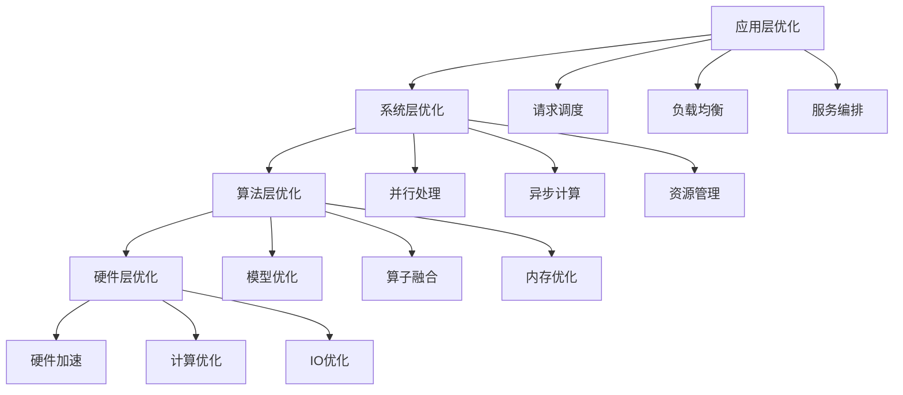
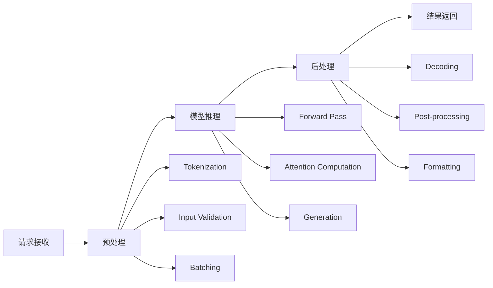
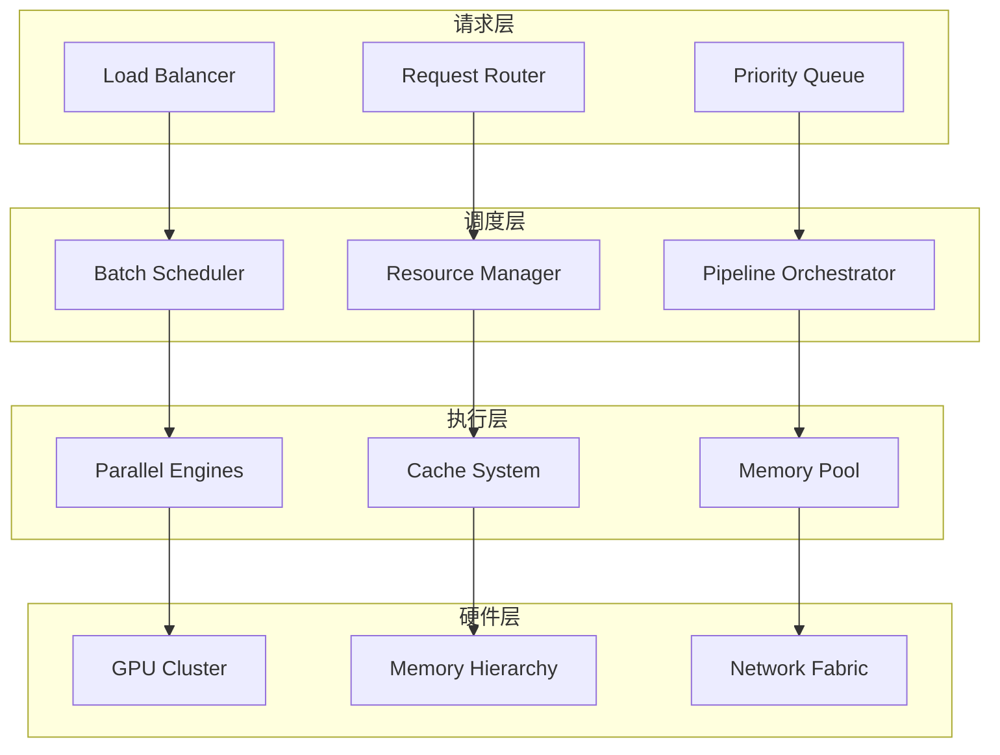

## 概述

推理管道优化是 LLM 推理系统性能提升的核心技术，通过系统化的设计和优化，实现高吞吐量、低延迟的推理服务。

### 核心目标

1. **提升吞吐量**:处理更多并发请求
2. **降低延迟**:减少单个请求的响应时间
3. **资源高效利用**:最大化硬件资源利用率
4. **系统稳定性**:保证服务的可靠性和可用性

### 优化层次

推理管道优化可以从以下几个层次进行:



## 推理管道架构

### 经典管道架构



### 现代优化架构



## 并行处理优化

### 并行处理策略

#### 1. 请求级并行(Request-Level Parallelism)

**核心思想**:同时处理多个独立的推理请求

**适用场景**:
- 多用户并发场景
- 批量处理任务
- 高吞吐量需求

**实现方式**:
```python
# 异步并发处理
async def parallel_inference(requests):
    """并行处理多个推理请求"""
    semaphore = asyncio.Semaphore(MAX_CONCURRENT)
    
    async def process_single_request(request):
        async with semaphore:
            return await inference_engine.process(request)
    
    tasks = [process_single_request(req) for req in requests]
    return await asyncio.gather(*tasks)
```

**优化要点**:
- 合理设置并发数限制
- 避免资源竞争
- 处理异常情况

#### 2. 数据并行(Data Parallelism)

**核心思想**:将批次数据分片到多个计算单元

**实现原理**:
```python
class DataParallelInference:
    def __init__(self, model, devices):
        self.model = model
        self.devices = devices
        self.replicas = [model.to(device) for device in devices]
    
    def forward(self, batch):
        # 数据分片
        batch_size = len(batch)
        chunk_size = batch_size // len(self.devices)
        chunks = [batch[i:i+chunk_size] 
                 for i in range(0, batch_size, chunk_size)]
        
        # 并行计算
        results = []
        for replica, chunk in zip(self.replicas, chunks):
            result = replica(chunk)
            results.append(result)
        
        # 结果合并
        return torch.cat(results, dim=0)
```

#### 3. 模型并行(Model Parallelism)

**核心思想**:将模型的不同部分分布到不同设备

**张量并行**:
```python
class TensorParallelLayer:
    def __init__(self, weight, devices):
        self.devices = devices
        # 按列分割权重矩阵
        self.weight_shards = torch.chunk(weight, len(devices), dim=1)
        self.weight_shards = [w.to(device) 
                             for w, device in zip(self.weight_shards, devices)]
    
    def forward(self, x):
        # 分布式矩阵乘法
        outputs = []
        for weight_shard, device in zip(self.weight_shards, self.devices):
            x_device = x.to(device)
            output = torch.matmul(x_device, weight_shard)
            outputs.append(output)
        
        # All-reduce聚合
        return all_reduce(outputs)
```

#### 4. 流水线并行(Pipeline Parallelism)

**核心思想**:将模型按层分割，形成流水线处理

**实现架构**:
```python
class PipelineStage:
    def __init__(self, layers, device):
        self.layers = nn.Sequential(*layers).to(device)
        self.device = device
        self.input_queue = Queue()
        self.output_queue = Queue()
    
    async def process_loop(self):
        while True:
            batch = await self.input_queue.get()
            with torch.no_grad():
                output = self.layers(batch.to(self.device))
            await self.output_queue.put(output)

class PipelineParallel:
    def __init__(self, stages):
        self.stages = stages
        self.micro_batch_size = 4
        
    async def forward(self, input_batch):
        # 微批次分割
        micro_batches = torch.chunk(input_batch, self.micro_batch_size)
        
        # 流水线执行
        pipeline_tasks = []
        for stage in self.stages:
            task = asyncio.create_task(stage.process_loop())
            pipeline_tasks.append(task)
        
        # 输入数据到第一阶段
        for micro_batch in micro_batches:
            await self.stages[0].input_queue.put(micro_batch)
        
        # 收集最终结果
        results = []
        for _ in micro_batches:
            result = await self.stages[-1].output_queue.get()
            results.append(result)
        
        return torch.cat(results, dim=0)
```

### 动态并行调度

#### 自适应批处理

```python
class AdaptiveBatcher:
    def __init__(self, max_batch_size=32, max_wait_time=0.01):
        self.max_batch_size = max_batch_size
        self.max_wait_time = max_wait_time
        self.pending_requests = []
        self.last_batch_time = time.time()
    
    async def add_request(self, request):
        self.pending_requests.append(request)
        
        # 批次已满或等待时间过长
        if (len(self.pending_requests) >= self.max_batch_size or
            time.time() - self.last_batch_time > self.max_wait_time):
            return await self.process_batch()
        
        return None
    
    async def process_batch(self):
        if not self.pending_requests:
            return []
        
        batch = self.pending_requests[:self.max_batch_size]
        self.pending_requests = self.pending_requests[self.max_batch_size:]
        self.last_batch_time = time.time()
        
        return await self.inference_engine.process_batch(batch)
```

## 异步处理优化

### 异步处理原理

异步处理是现代推理系统的核心特性，通过非阻塞IO和事件驱动的方式提升系统并发能力。

#### 核心概念

1. **非阻塞IO**:操作不会阻塞执行线程
2. **事件循环**:管理异步任务的调度
3. **协程**:轻量级的并发执行单元
4. **Future/Promise**:异步操作的结果占位符

### 异步推理引擎

```python
class AsyncInferenceEngine:
    def __init__(self, model, device):
        self.model = model.to(device)
        self.device = device
        self.request_queue = asyncio.Queue(maxsize=1000)
        self.result_futures = {}
        self.batch_processor = None
        
    async def start(self):
        """启动异步处理循环"""
        self.batch_processor = asyncio.create_task(self._batch_processing_loop())
    
    async def process_request(self, request_id, input_data):
        """提交异步推理请求"""
        future = asyncio.Future()
        self.result_futures[request_id] = future
        
        await self.request_queue.put({
            'id': request_id,
            'data': input_data,
            'timestamp': time.time()
        })
        
        return await future
    
    async def _batch_processing_loop(self):
        """批处理循环"""
        while True:
            batch = await self._collect_batch()
            if batch:
                await self._process_batch(batch)
    
    async def _collect_batch(self):
        """智能批次收集"""
        batch = []
        deadline = time.time() + 0.01  # 10ms超时
        
        while len(batch) < 32 and time.time() < deadline:
            try:
                request = await asyncio.wait_for(
                    self.request_queue.get(), 
                    timeout=deadline - time.time()
                )
                batch.append(request)
            except asyncio.TimeoutError:
                break
        
        return batch
    
    async def _process_batch(self, batch):
        """处理批次数据"""
        if not batch:
            return
        
        # 准备输入
        inputs = [req['data'] for req in batch]
        request_ids = [req['id'] for req in batch]
        
        # 模型推理
        with torch.no_grad():
            outputs = await self._async_forward(inputs)
        
        # 返回结果
        for req_id, output in zip(request_ids, outputs):
            if req_id in self.result_futures:
                self.result_futures[req_id].set_result(output)
                del self.result_futures[req_id]
    
    async def _async_forward(self, inputs):
        """异步前向传播"""
        # 转换为张量
        input_tensor = torch.stack(inputs).to(self.device)
        
        # 在执行器中运行推理
        loop = asyncio.get_event_loop()
        return await loop.run_in_executor(
            None, 
            lambda: self.model(input_tensor)
        )
```

### 事件驱动架构

```python
class EventDrivenInferenceSystem:
    def __init__(self):
        self.event_bus = EventBus()
        self.handlers = {}
        self.metrics = MetricsCollector()
        
    def register_handler(self, event_type, handler):
        """注册事件处理器"""
        if event_type not in self.handlers:
            self.handlers[event_type] = []
        self.handlers[event_type].append(handler)
    
    async def emit_event(self, event):
        """发送事件"""
        if event.type in self.handlers:
            tasks = [
                handler(event) 
                for handler in self.handlers[event.type]
            ]
            await asyncio.gather(*tasks, return_exceptions=True)
    
    async def handle_inference_request(self, request):
        """处理推理请求"""
        # 发送请求开始事件
        await self.emit_event(InferenceStartEvent(request))
        
        try:
            # 执行推理
            result = await self.inference_engine.process(request)
            
            # 发送完成事件
            await self.emit_event(InferenceCompleteEvent(request, result))
            
            return result
        except Exception as e:
            # 发送错误事件
            await self.emit_event(InferenceErrorEvent(request, e))
            raise
```

### 流式处理

```python
class StreamingInference:
    def __init__(self, model):
        self.model = model
        
    async def stream_generate(self, prompt, max_tokens=100):
        """流式生成"""
        input_ids = self.tokenizer.encode(prompt)
        
        for _ in range(max_tokens):
            # 推理下一个token
            with torch.no_grad():
                logits = self.model(torch.tensor([input_ids]))
                next_token = torch.multinomial(
                    F.softmax(logits[0, -1], dim=-1), 1
                ).item()
            
            input_ids.append(next_token)
            
            # 流式返回
            yield {
                'token': next_token,
                'text': self.tokenizer.decode([next_token]),
                'is_complete': next_token == self.tokenizer.eos_token_id
            }
            
            if next_token == self.tokenizer.eos_token_id:
                break
            
            # 异步让出控制权
            await asyncio.sleep(0)
```

## 调度优化

### 智能调度策略

#### 1. 负载感知调度

```python
class LoadAwareScheduler:
    def __init__(self, workers):
        self.workers = workers
        self.load_tracker = LoadTracker()
        self.request_predictor = RequestPredictor()
        
    async def schedule_request(self, request):
        """智能调度请求"""
        # 获取当前负载状态
        loads = await self.load_tracker.get_current_loads()
        
        # 预测请求执行时间
        predicted_time = self.request_predictor.predict(request)
        
        # 选择最优worker
        best_worker = self._select_optimal_worker(
            loads, predicted_time, request
        )
        
        return await best_worker.process(request)
    
    def _select_optimal_worker(self, loads, predicted_time, request):
        """选择最优worker"""
        scores = []
        
        for worker in self.workers:
            # 计算综合评分
            load_score = 1.0 - loads[worker.id] / worker.capacity
            latency_score = 1.0 / (loads[worker.id] * predicted_time + 1e-6)
            affinity_score = self._calculate_affinity(worker, request)
            
            total_score = (
                0.4 * load_score + 
                0.4 * latency_score + 
                0.2 * affinity_score
            )
            scores.append((total_score, worker))
        
        return max(scores, key=lambda x: x[0])[1]
    
    def _calculate_affinity(self, worker, request):
        """计算亲和性评分"""
        # 考虑模型缓存、历史处理等因素
        affinity = 0.0
        
        # 模型缓存亲和性
        if worker.has_model_cached(request.model_id):
            affinity += 0.5
        
        # 历史处理亲和性
        if worker.has_processed_similar(request):
            affinity += 0.3
        
        return affinity
```

#### 2. 优先级调度

```python
class PriorityScheduler:
    def __init__(self):
        self.queues = {
            Priority.URGENT: PriorityQueue(),
            Priority.HIGH: PriorityQueue(),
            Priority.NORMAL: PriorityQueue(),
            Priority.LOW: PriorityQueue()
        }
        self.processing_tasks = {}
        
    async def submit_request(self, request, priority=Priority.NORMAL):
        """提交请求"""
        await self.queues[priority].put((request.timestamp, request))
        return await self._process_requests()
    
    async def _process_requests(self):
        """处理请求"""
        while True:
            # 按优先级顺序处理
            for priority in [Priority.URGENT, Priority.HIGH, 
                           Priority.NORMAL, Priority.LOW]:
                if not self.queues[priority].empty():
                    _, request = await self.queues[priority].get()
                    
                    # 创建处理任务
                    task = asyncio.create_task(self._handle_request(request))
                    self.processing_tasks[request.id] = task
                    
                    return await task
            
            # 没有请求时等待
            await asyncio.sleep(0.01)
    
    async def _handle_request(self, request):
        """处理单个请求"""
        try:
            result = await self.inference_engine.process(request)
            return result
        except Exception as e:
            # 错误处理
            await self._handle_error(request, e)
            raise
        finally:
            # 清理
            if request.id in self.processing_tasks:
                del self.processing_tasks[request.id]
```

### 资源管理

#### 动态资源分配

```python
class DynamicResourceManager:
    def __init__(self, total_resources):
        self.total_resources = total_resources
        self.allocations = {}
        self.resource_monitor = ResourceMonitor()
        self.allocation_history = []
        
    async def allocate_resources(self, request):
        """动态分配资源"""
        # 分析请求需求
        requirement = await self._analyze_requirement(request)
        
        # 检查资源可用性
        available = await self._check_availability(requirement)
        
        if available:
            # 分配资源
            allocation = await self._perform_allocation(request, requirement)
            self.allocations[request.id] = allocation
            return allocation
        else:
            # 资源不足时的处理策略
            return await self._handle_resource_shortage(request, requirement)
    
    async def _analyze_requirement(self, request):
        """分析资源需求"""
        # 基于历史数据预测
        base_requirement = self._get_base_requirement(request)
        
        # 考虑模型复杂度
        complexity_factor = self._calculate_complexity(request)
        
        # 考虑批次大小
        batch_factor = self._calculate_batch_factor(request)
        
        return ResourceRequirement(
            memory=base_requirement.memory * complexity_factor,
            compute=base_requirement.compute * batch_factor,
            duration=base_requirement.duration * complexity_factor
        )
    
    async def _handle_resource_shortage(self, request, requirement):
        """处理资源不足"""
        # 尝试抢占低优先级任务
        if request.priority >= Priority.HIGH:
            preempted = await self._preempt_low_priority_tasks(requirement)
            if preempted:
                return await self._perform_allocation(request, requirement)
        
        # 加入等待队列
        await self._add_to_waiting_queue(request, requirement)
        return None
    
    async def release_resources(self, request_id):
        """释放资源"""
        if request_id in self.allocations:
            allocation = self.allocations[request_id]
            await self._release_allocation(allocation)
            del self.allocations[request_id]
            
            # 处理等待队列
            await self._process_waiting_queue()
```

## 性能监控与调优

### 性能指标体系

#### 关键性能指标(KPIs)

```python
class PerformanceMetrics:
    def __init__(self):
        self.metrics = {
            # 延迟指标
            'latency': {
                'p50': Histogram(),
                'p95': Histogram(),
                'p99': Histogram(),
                'avg': RunningAverage()
            },
            # 吞吐量指标
            'throughput': {
                'qps': Counter(),
                'tokens_per_second': Counter(),
                'batch_size': Histogram()
            },
            # 资源利用率
            'resource_utilization': {
                'gpu_utilization': Gauge(),
                'memory_usage': Gauge(),
                'cpu_usage': Gauge()
            },
            # 错误率
            'error_rate': {
                'total_errors': Counter(),
                'timeout_errors': Counter(),
                'system_errors': Counter()
            }
        }
    
    def record_request(self, request_id, latency, tokens, success):
        """记录请求指标"""
        # 记录延迟
        self.metrics['latency']['p50'].observe(latency)
        self.metrics['latency']['p95'].observe(latency)
        self.metrics['latency']['p99'].observe(latency)
        self.metrics['latency']['avg'].update(latency)
        
        # 记录吞吐量
        self.metrics['throughput']['qps'].increment()
        self.metrics['throughput']['tokens_per_second'].increment(tokens)
        
        # 记录错误
        if not success:
            self.metrics['error_rate']['total_errors'].increment()
    
    def get_dashboard_data(self):
        """获取仪表盘数据"""
        return {
            'latency_p99': self.metrics['latency']['p99'].quantile(0.99),
            'qps': self.metrics['throughput']['qps'].rate(),
            'gpu_utilization': self.metrics['resource_utilization']['gpu_utilization'].value,
            'error_rate': self.metrics['error_rate']['total_errors'].rate()
        }
```

### 实时监控系统

```python
class RealTimeMonitor:
    def __init__(self, update_interval=1.0):
        self.update_interval = update_interval
        self.metrics_collector = MetricsCollector()
        self.alert_manager = AlertManager()
        self.dashboard = Dashboard()
        
    async def start_monitoring(self):
        """启动实时监控"""
        monitoring_tasks = [
            asyncio.create_task(self._collect_metrics()),
            asyncio.create_task(self._check_alerts()),
            asyncio.create_task(self._update_dashboard())
        ]
        await asyncio.gather(*monitoring_tasks)
    
    async def _collect_metrics(self):
        """收集性能指标"""
        while True:
            try:
                # 收集系统指标
                system_metrics = await self._collect_system_metrics()
                
                # 收集应用指标
                app_metrics = await self._collect_app_metrics()
                
                # 存储指标
                await self.metrics_collector.store_metrics({
                    **system_metrics,
                    **app_metrics,
                    'timestamp': time.time()
                })
                
            except Exception as e:
                logging.error(f"指标收集失败: {e}")
            
            await asyncio.sleep(self.update_interval)
    
    async def _check_alerts(self):
        """检查告警条件"""
        while True:
            try:
                current_metrics = await self.metrics_collector.get_latest_metrics()
                
                # 检查各种告警条件
                alerts = []
                
                # 延迟告警
                if current_metrics.get('latency_p99', 0) > 1000:
                    alerts.append(Alert(
                        type='HIGH_LATENCY',
                        severity='WARNING',
                        message=f"P99延迟过高: {current_metrics['latency_p99']}ms"
                    ))
                
                # 错误率告警
                if current_metrics.get('error_rate', 0) > 0.05:
                    alerts.append(Alert(
                        type='HIGH_ERROR_RATE',
                        severity='CRITICAL',
                        message=f"错误率过高: {current_metrics['error_rate']*100:.2f}%"
                    ))
                
                # 资源利用率告警
                if current_metrics.get('gpu_utilization', 0) > 0.95:
                    alerts.append(Alert(
                        type='HIGH_GPU_USAGE',
                        severity='WARNING',
                        message=f"GPU利用率过高: {current_metrics['gpu_utilization']*100:.1f}%"
                    ))
                
                # 发送告警
                for alert in alerts:
                    await self.alert_manager.send_alert(alert)
                
            except Exception as e:
                logging.error(f"告警检查失败: {e}")
            
            await asyncio.sleep(self.update_interval)
```

### 自动调优系统

```python
class AutoTuningSystem:
    def __init__(self):
        self.config_manager = ConfigManager()
        self.performance_analyzer = PerformanceAnalyzer()
        self.tuning_strategies = [
            BatchSizeTuning(),
            ConcurrencyTuning(),
            MemoryTuning(),
            CacheTuning()
        ]
        
    async def start_auto_tuning(self):
        """启动自动调优"""
        while True:
            try:
                # 分析当前性能
                performance_report = await self.performance_analyzer.analyze()
                
                # 识别优化机会
                opportunities = await self._identify_opportunities(performance_report)
                
                # 应用调优策略
                for opportunity in opportunities:
                    await self._apply_tuning_strategy(opportunity)
                
                # 等待下一轮调优
                await asyncio.sleep(300)  # 5分钟间隔
                
            except Exception as e:
                logging.error(f"自动调优失败: {e}")
                await asyncio.sleep(60)  # 出错时等待1分钟
    
    async def _identify_opportunities(self, performance_report):
        """识别优化机会"""
        opportunities = []
        
        # 分析瓶颈
        bottlenecks = performance_report.bottlenecks
        
        for bottleneck in bottlenecks:
            if bottleneck.type == 'LOW_GPU_UTILIZATION':
                opportunities.append(OptimizationOpportunity(
                    type='INCREASE_BATCH_SIZE',
                    priority='HIGH',
                    expected_improvement=0.2
                ))
            elif bottleneck.type == 'HIGH_LATENCY':
                opportunities.append(OptimizationOpportunity(
                    type='INCREASE_CONCURRENCY',
                    priority='MEDIUM',
                    expected_improvement=0.15
                ))
            elif bottleneck.type == 'MEMORY_PRESSURE':
                opportunities.append(OptimizationOpportunity(
                    type='OPTIMIZE_MEMORY',
                    priority='HIGH',
                    expected_improvement=0.1
                ))
        
        return sorted(opportunities, key=lambda x: x.priority, reverse=True)
    
    async def _apply_tuning_strategy(self, opportunity):
        """应用调优策略"""
        for strategy in self.tuning_strategies:
            if strategy.can_handle(opportunity):
                # 创建调优计划
                plan = await strategy.create_plan(opportunity)
                
                # 执行A/B测试
                result = await self._run_ab_test(plan)
                
                # 如果改进显著，应用配置
                if result.improvement > 0.05:
                    await self.config_manager.apply_config(plan.config)
                    logging.info(f"应用调优策略: {plan.description}")
                
                break
```

## 最佳实践

### 设计原则

#### 1. 性能优先原则

```python
# 示例：性能优先的设计模式
class PerformanceOptimizedInference:
    def __init__(self):
        # 预分配资源
        self.memory_pool = MemoryPool(size=1024*1024*1024)  # 1GB
        self.compute_pool = ComputePool(workers=8)
        
        # 预编译模型
        self.compiled_models = {}
        
        # 预热缓存
        self.cache = LRUCache(maxsize=10000)
    
    async def precompile_models(self, model_configs):
        """预编译模型"""
        for config in model_configs:
            compiled_model = await self._compile_model(config)
            self.compiled_models[config.id] = compiled_model
    
    async def warm_up_cache(self, sample_requests):
        """预热缓存"""
        for request in sample_requests:
            await self.process_request(request, warm_up=True)
```

#### 2. 可扩展性原则

```python
# 示例：可扩展的架构设计
class ScalableInferenceSystem:
    def __init__(self):
        self.worker_pool = WorkerPool()
        self.load_balancer = LoadBalancer()
        self.auto_scaler = AutoScaler()
        
    async def scale_based_on_load(self):
        """基于负载自动扩缩容"""
        current_load = await self.load_balancer.get_current_load()
        
        if current_load > 0.8:
            # 扩容
            await self.auto_scaler.scale_up()
        elif current_load < 0.3:
            # 缩容
            await self.auto_scaler.scale_down()
```

#### 3. 容错性原则

```python
# 示例：容错性设计
class FaultTolerantInference:
    def __init__(self):
        self.retry_policy = RetryPolicy(max_retries=3)
        self.circuit_breaker = CircuitBreaker()
        self.fallback_handler = FallbackHandler()
    
    async def robust_inference(self, request):
        """容错推理"""
        try:
            # 尝试正常推理
            return await self.circuit_breaker.call(
                self._do_inference, request
            )
        except Exception as e:
            # 降级处理
            return await self.fallback_handler.handle(request, e)
```

### 性能调优指南

#### 系统层面调优

1. **操作系统优化**
   ```bash
   # 调整内核参数
   echo 'net.core.rmem_max = 67108864' >> /etc/sysctl.conf
   echo 'net.core.wmem_max = 67108864' >> /etc/sysctl.conf
   
   # 设置CPU亲和性
   taskset -c 0-7 python inference_server.py
   
   # 设置GPU时钟频率
   nvidia-smi -ac 6001,1590
   ```

2. **内存管理优化**
   ```python
   # 内存池管理
   class MemoryManager:
       def __init__(self):
           self.pools = {
               'small': MemoryPool(block_size=1024, count=10000),
               'medium': MemoryPool(block_size=8192, count=1000),
               'large': MemoryPool(block_size=65536, count=100)
           }
       
       def allocate(self, size):
           if size <= 1024:
               return self.pools['small'].allocate()
           elif size <= 8192:
               return self.pools['medium'].allocate()
           else:
               return self.pools['large'].allocate()
   ```

3. **网络优化**
   ```python
   # 连接池管理
   class ConnectionPoolManager:
       def __init__(self):
           self.pools = {}
       
       async def get_connection(self, host, port):
           key = f"{host}:{port}"
           if key not in self.pools:
               self.pools[key] = ConnectionPool(
                   host=host, port=port,
                   min_size=10, max_size=100
               )
           return await self.pools[key].acquire()
   ```

#### 应用层面调优

1. **批处理优化**
   ```python
   # 智能批处理
   class SmartBatcher:
       def __init__(self):
           self.batch_configs = {
               'small_model': {'max_size': 64, 'timeout': 5},
               'large_model': {'max_size': 16, 'timeout': 10}
           }
       
       def get_optimal_batch_size(self, model_type, current_load):
           config = self.batch_configs[model_type]
           if current_load > 0.8:
               return config['max_size'] // 2
           else:
               return config['max_size']
   ```

2. **缓存策略优化**
   ```python
   # 多级缓存
   class MultiLevelCache:
       def __init__(self):
           self.l1_cache = LRUCache(maxsize=1000)  # 内存缓存
           self.l2_cache = RedisCache(host='localhost', port=6379)  # 分布式缓存
           self.l3_cache = DiskCache(path='/tmp/cache')  # 磁盘缓存
       
       async def get(self, key):
           # L1缓存
           if key in self.l1_cache:
               return self.l1_cache[key]
           
           # L2缓存
           value = await self.l2_cache.get(key)
           if value:
               self.l1_cache[key] = value
               return value
           
           # L3缓存
           value = await self.l3_cache.get(key)
           if value:
               self.l1_cache[key] = value
               await self.l2_cache.set(key, value)
               return value
           
           return None
   ```

### 常见问题与解决方案

#### 性能问题诊断

1. **延迟问题**
   ```python
   class LatencyDiagnostics:
       def __init__(self):
           self.profiler = PerformanceProfiler()
       
       async def diagnose_latency(self, request):
           with self.profiler.trace('request_processing'):
               # 分段计时
               with self.profiler.trace('preprocessing'):
                   preprocessed = await self.preprocess(request)
               
               with self.profiler.trace('inference'):
                   result = await self.inference(preprocessed)
               
               with self.profiler.trace('postprocessing'):
                   final_result = await self.postprocess(result)
           
           # 分析瓶颈
           bottlenecks = self.profiler.get_bottlenecks()
           return bottlenecks
   ```

2. **内存泄漏问题**
   ```python
   class MemoryLeakDetector:
       def __init__(self):
           self.baseline_memory = None
           self.memory_tracker = MemoryTracker()
       
       async def detect_leaks(self):
           if self.baseline_memory is None:
               self.baseline_memory = self.memory_tracker.get_current_usage()
               return
           
           current_memory = self.memory_tracker.get_current_usage()
           growth = current_memory - self.baseline_memory
           
           if growth > MEMORY_GROWTH_THRESHOLD:
               # 执行内存分析
               leak_report = await self.memory_tracker.analyze_leaks()
               await self.send_alert(leak_report)
   ```

3. **资源竞争问题**
   ```python
   class ResourceContentionResolver:
       def __init__(self):
           self.lock_manager = LockManager()
           self.deadlock_detector = DeadlockDetector()
       
       async def resolve_contention(self):
           # 检测死锁
           deadlocks = await self.deadlock_detector.detect()
           
           for deadlock in deadlocks:
               # 解决死锁
               await self.lock_manager.break_deadlock(deadlock)
           
           # 优化锁粒度
           await self.lock_manager.optimize_lock_granularity()
   ```

## 总结

推理管道优化是一个系统性工程，需要从多个层面进行综合考虑和优化。通过本文介绍的理论框架和实践方法，可以构建高性能、高可用的 LLM 推理系统。

关键要点:
1. **系统化思维**:从架构设计到具体实现的全链路优化
2. **性能监控**:建立完善的监控和告警机制
3. **持续优化**:基于数据驱动的持续调优
4. **最佳实践**:遵循设计原则和行业最佳实践

在实际应用中，需要根据具体的业务场景和资源约束，选择合适的优化策略和实现方案。
